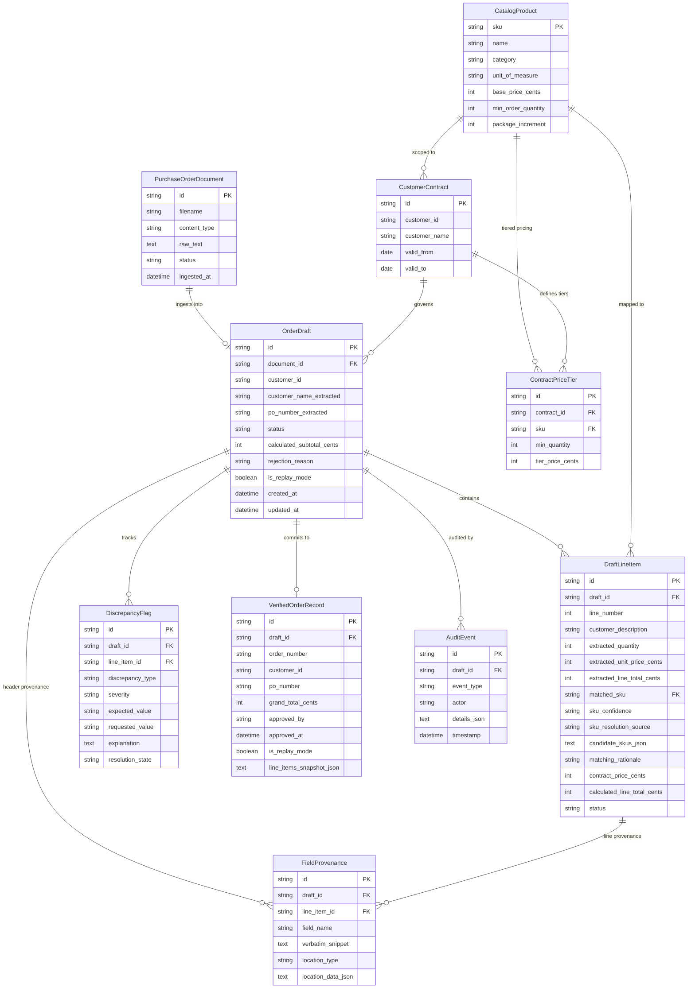
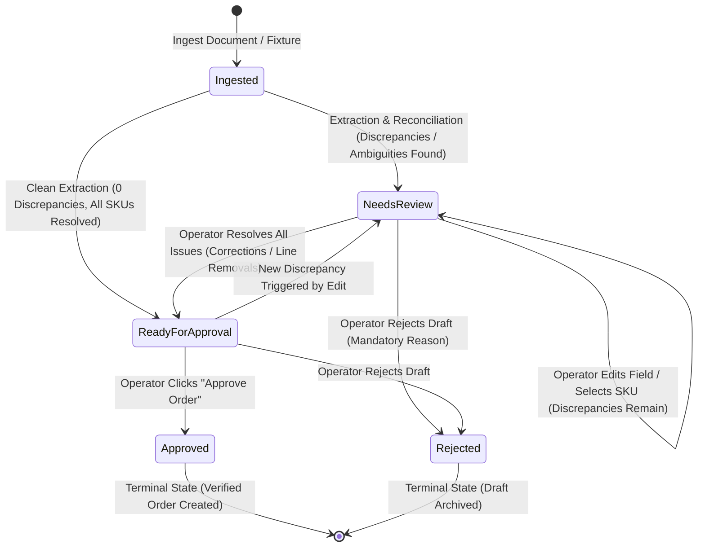

# Data Model: OrderShield Purchase Order Reconciliation

**Feature Branch**: `001-ordershield-po-reconciliation`  
**Date**: 2026-09-29  
**Status**: Ready for Planning (Human Gate Final Reconciliation)  

---

## 1. Domain Entities & Database Schema

The persistent data model is implemented in **SQLite** via SQLAlchemy models, mapping directly to domain business entities.

### Exact Monetary Persistence Policy (Integer Cents)
- **SQLite Storage**: All monetary columns (`subtotal_cents`, `unit_price_cents`, `line_total_cents`, `grand_total_cents`, `tier_price_cents`, `base_price_cents`) are stored as **exact integers representing currency cents** (`INTEGER` column type).
- **Domain & API Boundary**: The application maps integer cents to and from Python `decimal.Decimal` with 2 decimal places (`Decimal("25.00")` <-> `2500`). Binary floating-point (`float`) is strictly prohibited.

---

## 2. Entity Specifications

### 2.1 `PurchaseOrderDocument`
Stores incoming raw document assets and canonical text.
- `id`: UUID (Primary Key).
- `filename`: Original name of uploaded file (e.g., `PO_ACME_10928.pdf`).
- `content_type`: MIME type (`text/plain` or `application/pdf`).
- `raw_text`: Canonical UTF-8 plain text string extracted from the document. Serves as the single reference text for reproducible grounding and correction verification.
- `status`: Lifecycle state (`Ingested`, `Failed`).
- `ingested_at`: UTC timestamp of upload.

### 2.2 `CatalogProduct`
Master catalog items.
- `sku`: String (Primary Key, e.g. `SKU-WRAP-18`).
- `name`: Standard product name.
- `category`: Product category.
- `unit_of_measure`: Standard unit of measure (`Roll`, `Case`, `Box`).
- `base_price_cents`: Default base price in integer cents (e.g. `2450` for $24.50).
- `min_order_quantity`: Minimum purchase quantity constraint.
- `package_increment`: Standard packaging multiple constraint (e.g. must order in multiples of 1, 5, or 10).

### 2.3 `CustomerContract` & `ContractPriceTier`
Quantity-tiered commercial agreements.
- **`CustomerContract`**:
  - `id`: UUID (Primary Key).
  - `customer_id`: Customer identifier (e.g., `CUST-ACME`).
  - `customer_name`: Standard customer legal name.
  - `valid_from` / `valid_to`: Contract active date window.
- **`ContractPriceTier`**:
  - `id`: UUID (Primary Key).
  - `contract_id`: Foreign key referencing `CustomerContract.id`.
  - `sku`: Foreign key referencing `CatalogProduct.sku`.
  - `min_quantity`: Threshold quantity required to unlock tier (e.g., `1`, `10`, `50`).
  - `tier_price_cents`: Exact unit price in integer cents (e.g., `2100` for $21.00).

#### Deterministic Tier Selection Rule:
Given customer $C$, SKU $S$, and requested quantity $Q$:
1. Query all `ContractPriceTier` records where `contract.customer_id == C`, `sku == S`, and `min_quantity <= Q`.
2. Select the record with the maximum `min_quantity`. Its `tier_price_cents` is the authoritative contract price.
3. If no tier has `min_quantity <= Q`, the contract price lookup fails and flags a `PriceMismatch` against the base price or contract baseline.

### 2.4 `OrderDraft`
The central working entity for an intake reconciliation session.
- `id`: UUID (Primary Key).
- `document_id`: Foreign key referencing `PurchaseOrderDocument`.
- `customer_id`: Resolved customer identifier mapping to a contract.
- `customer_name_extracted`: Verbatim customer name string extracted from PO.
- `po_number_extracted`: Verbatim PO reference number extracted from PO.
- `status`: State indicator (`Ingested`, `Needs Review`, `Ready for Approval`, `Approved`, `Rejected`).
- `calculated_subtotal_cents`: Authoritative integer cents sum of active lines.
- `rejection_reason`: Mandatory text string populated if draft is rejected.
- `is_replay_mode`: Boolean flag (`false` for live intake; `true` for fixture replay).
- `created_at` / `updated_at`: Audit timestamps.

### 2.5 `DraftLineItem`
An individual order item extracted from the document.
- `id`: UUID (Primary Key).
- `draft_id`: Foreign key referencing `OrderDraft`.
- `line_number`: 1-based sequential line index.
- `customer_description`: Raw customer item text.
- `extracted_quantity`: Raw parsed integer quantity.
- `extracted_unit_price_cents`: Raw parsed unit price in integer cents.
- `extracted_line_total_cents`: Raw stated line total in integer cents.
- `matched_sku`: Catalog SKU code assigned to this line.
- `sku_confidence`: State (`High`, `Ambiguous`, `Unrecognized`).
- `sku_resolution_source`: Deterministic resolution state:
  - `NONE`: No SKU assigned yet (unresolved).
  - `AI_HIGH_CONFIDENCE`: Automatically resolved by AI provider with high confidence.
  - `OPERATOR_SELECTED`: Explicitly selected/confirmed by the operator.
- `candidate_skus_json`: Serialized JSON array of alternative matches `[{"sku": "...", "name": "...", "score": 0.85, "rationale": "..."}]`.
- `matching_rationale`: Brief explanation of the semantic match.
- `contract_price_cents`: Evaluated contract tier rate in integer cents.
- `calculated_line_total_cents`: Authoritative calculation (`extracted_quantity * contract_price_cents`).
- `status`: State (`Active`, `Removed`).

### 2.6 `FieldProvenance` (Mandatory Field Grounding)
Captures explicit, reproducible grounding for every mandatory extracted field.
- `id`: UUID (Primary Key).
- `draft_id`: Foreign key referencing `OrderDraft`.
- `line_item_id`: Optional foreign key referencing `DraftLineItem` (null for header-level fields).
- `field_name`: Exact field identifier:
  - Header: `customer_name`, `po_number`
  - Line Item: `customer_description`, `extracted_quantity`, `extracted_unit_price`, `extracted_line_total`
- `verbatim_snippet`: Exact substring from the canonical `PurchaseOrderDocument.raw_text`.
- `location_type`: Format (`txt` or `pdf`).
- `location_data_json`: Canonical offset object:
  - For `.txt`: `{"type": "txt", "line_number": int, "char_offset": int}`
  - For `.pdf`: `{"type": "pdf", "page_number": int, "char_start": int, "char_end": int}` within canonical extracted text.

### 2.7 `DiscrepancyFlag`
Tracks detected discrepancies against business rules.
- `id`: UUID (Primary Key).
- `draft_id`: Foreign key referencing `OrderDraft`.
- `line_item_id`: Optional foreign key referencing `DraftLineItem`.
- `discrepancy_type`: Exactly one of:
  - `PriceMismatch`: Customer stated unit price != contract tier unit price.
  - `QuantityOrPackagingBreach`: Extracted quantity < MOQ or invalid packaging increment.
  - `ArithmeticMismatch`: Customer line total != qty * unit price, or stated grand total != sum of line totals.
  - `CatalogMatchingMismatch`: Description is ambiguous or unrecognized.
- `severity`: Level (`Blocking`, `Warning`). All four types are `Blocking` in MVP.
- `expected_value`: Expected business rule value (e.g., `"$24.50"`, `"MOQ: 10"`).
- `requested_value`: Extracted customer value (e.g., `"$21.00"`, `"Qty: 4"`).
- `explanation`: Human-readable description of discrepancy.
- `resolution_state`: State (`Unresolved`, `ResolvedByCorrection`, `ResolvedByLineRemoval`).

### 2.8 `VerifiedOrderRecord`
Immutable record created upon human approval.
- `id`: UUID (Primary Key).
- `draft_id`: Unique foreign key referencing `OrderDraft` (one-to-one; prevents duplicate orders).
- `order_number`: Formatted commercial reference (e.g., `VO-2026-0001`).
- `customer_id`: Verified customer account.
- `po_number`: Verified customer PO reference.
- `grand_total_cents`: Final verified order total in integer cents.
- `approved_by`: Identity of the approving operator.
- `approved_at`: UTC timestamp of approval.
- `is_replay_mode`: Replay status flag.
- `line_items_snapshot_json`: Immutable JSON snapshot of all approved lines.

### 2.9 `AuditEvent`
Append-only log of every interaction.
- `id`: UUID (Primary Key).
- `draft_id`: Foreign key referencing `OrderDraft`.
- `event_type`: Action type (`DocumentIngested`, `AIExtractionCompleted`, `FieldCorrected`, `SKUSelected`, `LineRemoved`, `DraftRejected`, `OrderApproved`).
- `actor`: Entity initiating event (`System`, `AIProvider`, `Operator`).
- `details_json`: Snapshot of previous and updated values or operator notes.
- `timestamp`: UTC event timestamp.

---

## 3. State Machine & Invariants

### Deterministic State Invariants:

1. **"Ready for Approval" Gate**:
   An Order Draft enters `Ready for Approval` **if and only if**:
   - `customer_id` and `po_number_extracted` are present and non-empty.
   - Every active line item (`status == "Active"`) satisfies:
     - `matched_sku IS NOT NULL`
     - `sku_resolution_source IN ('AI_HIGH_CONFIDENCE', 'OPERATOR_SELECTED')`
   - Total count of `DiscrepancyFlag` records with `resolution_state == "Unresolved"` across the draft is exactly **0**.
   - *Note*: The engine checks `sku_resolution_source` directly on `DraftLineItem`; it does not search audit history.

2. **Line Removal & Discrepancy History Preservation**:
   - When an operator removes a line (`DELETE /api/v1/drafts/{id}/lines/{line_id}`), the line item transitions to `status = "Removed"`.
   - All associated `DiscrepancyFlag` records transition from `resolution_state = "Unresolved"` to `resolution_state = "ResolvedByLineRemoval"`.
   - Discrepancy records are **never deleted**, preserving full auditability.

3. **Field Correction Grounding Validation**:
   - When an operator updates a field (`action = "CorrectField"`), the server validates the new value and its grounding snippet against `PurchaseOrderDocument.raw_text`.
   - If the snippet is not present at the specified location in `raw_text` or does not contain the corrected value, the server rejects the request with HTTP **`422 Unprocessable Entity`** (`SourceGroundingMismatchError`).

4. **Terminal State Immutability**:
   - `Approved` and `Rejected` are **terminal states**.
   - Any `PATCH`, `DELETE`, `approve`, or `reject` call on a terminal draft returns HTTP **`409 Conflict`**.

5. **Atomic Approval & Idempotency**:
   - Approving an order executes in a single atomic database transaction: (1) verify `Ready for Approval`, (2) insert `VerifiedOrderRecord`, (3) update draft status to `Approved`, (4) insert `AuditEvent`.
   - `VerifiedOrderRecord.draft_id` is uniquely constrained; repeated approvals return HTTP **`409 Conflict`** without creating duplicate orders.
